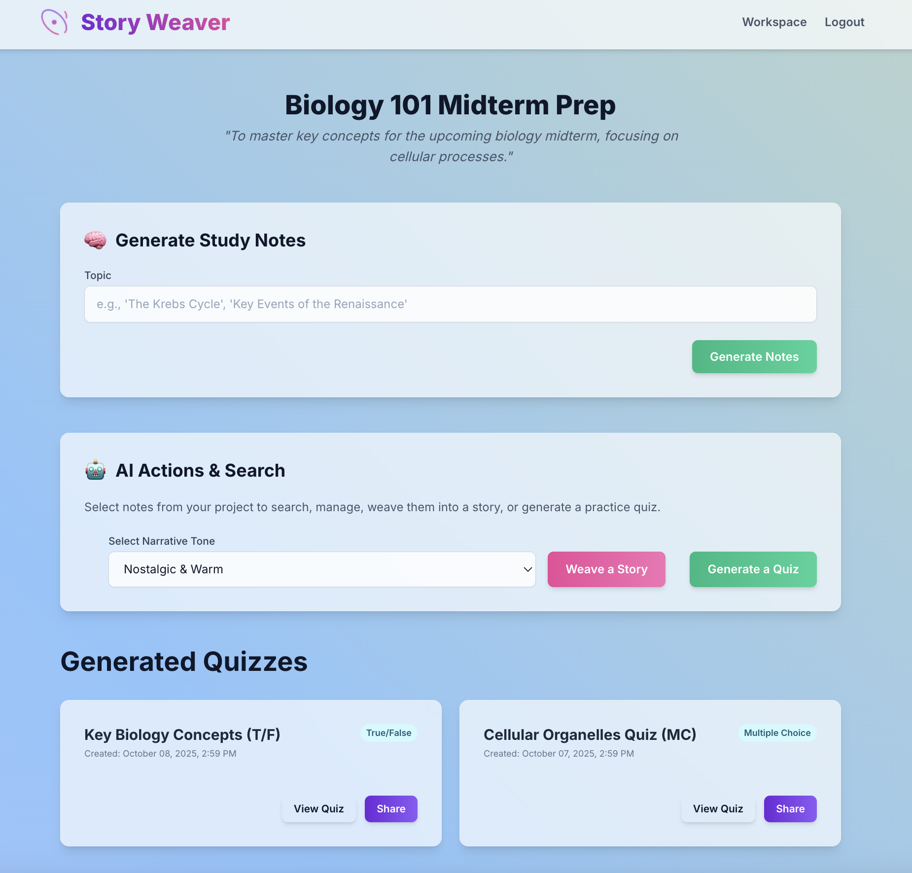
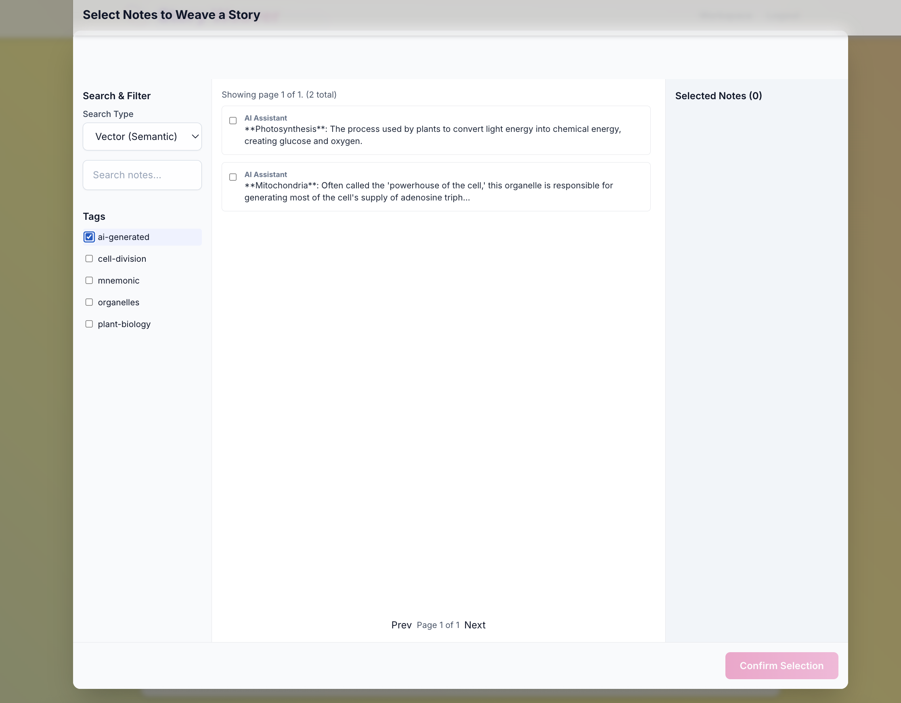
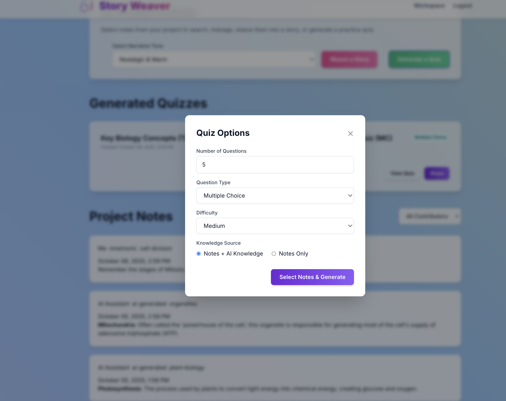

# STORYWEAVER

---



# The Alchemy of AI: Turning Raw Notes into Actionable Knowledge

We are all drowning in information. Meeting notes, article highlights, team feedback, random shower thoughts—we are prolific collectors of digital fragments. But collection is the easy part. The real work, the alchemy that turns lead into gold, is transforming that chaotic heap of raw data into something cohesive, understandable, and, most importantly, *useful*.

The code behind modern applications isn't just building another note-taking app; it's architecting an **Insight Engine**. It provides a blueprint for an AI-powered system designed to manage the entire lifecycle of knowledge. This engine creates a seamless workflow that guides information through four critical stages: from intelligent collection and AI-assisted structuring to creative synthesis and practical application.

Let's break down how this engine performs its alchemy, transforming scattered data points into a powerful, interconnected web of knowledge.

-----

## Stage 1: The Art of Collection — Beyond the Digital Shoebox

Insightful output begins with intelligent input. The traditional "drop box" model of data collection—where information is passively received—is broken. It’s a one-way street that creates data silos. This engine redesigns collection as a dynamic, guided conversation.

The system’s foundation is built on **projects**, which act as dedicated containers for a specific goal. But getting information from multiple people into one place is where the magic begins.

  * **Targeted Invitations:** For focused input, a project owner can generate a unique, private link for a specific person. This isn't just a link to a form; it's tied to a contributor's name and an initial prompt.
  * **Open Invitations:** For broader feedback from a group, a public, shareable link can be created, allowing anyone to contribute by simply providing their name.

> #### **Example in Action: The Family Historian**
>
> Sarah is compiling stories from her relatives for her grandparents' 50th wedding anniversary. She creates a project and sends **targeted invitation links** to her aunts and uncles with the prompt: *"What's your single most vivid memory of Mom and Dad?"*
>
> When her uncle submits a short anecdote, the process doesn't just end. The system’s AI instantly analyzes his response and generates three insightful, open-ended follow-up questions, such as *"What made that day so special for you?"* or *"Can you describe the look on her face?"*
>
> This transforms a static form into an **AI-guided interview**, encouraging relatives to dig deeper and provide the rich, emotional details that a simple prompt would never capture.

-----

## Stage 2: The AI Archivist — Imposing Order on Chaos

Collected data is still just raw data. Before it can be synthesized, it needs structure. Manually tagging hundreds of notes is tedious, time-consuming, and rife with inconsistency. The Insight Engine introduces an AI assistant to serve as an intelligent archivist.

When a user writes a note, they can simply click a "Suggest" button. This action calls the `/api/suggest-tags` endpoint, which is far more clever than a simple keyword scanner. The AI is engineered to do two things simultaneously:

1.  It analyzes the **content of the new note** to understand its core themes.
2.  It reviews **previously tagged notes** within the same project to learn the user's personal organizational style and vocabulary.

This dual approach ensures the AI suggests tags that are not only relevant but also consistent with the user's existing mental model.

> #### **Example in Action: The Product Manager**
>
> Maria, a product manager, is triaging user feedback. She pastes a note: *"A customer reported that the new dashboard is confusing, especially the date filter. They suggest simplifying it to presets like 'Last 7 Days' instead of a calendar picker."*
>
> She clicks "Suggest Tags." The AI, having seen her tag similar notes before, instantly suggests: `[#ux-feedback, #dashboard, #feature-request]`. This simple act saves time and eliminates ambiguity, ensuring the project's data is organized logically and ready for the next stage.

-----

## Stage 3: The Narrative Weaver — From Bullet Points to a Coherent Story



With a well-structured collection of notes, the next challenge is to see the forest for the trees. The `generate-story` endpoint is the system's narrative engine, designed to weave disparate notes into a single, coherent piece of prose.

The front-end, detailed in `main.js`, provides a powerful note-selection modal where the user acts as a **curator**. Using search, tag filters, and pagination, they can hand-select the exact "ingredients" for their narrative. This curated context is then sent to the AI with two parameters: the content and a desired **tone** (e.g., "Nostalgic & Warm," "Hardboiled Detective," or "Formal & Academic").

The AI's prompt is explicit: `"Synthesize these notes... into a short narrative... Connect the ideas, infer themes, and create a fluid arc."`

> #### **Example in Action: The Stakeholder Update**
>
> It's time for Maria's weekly stakeholder update. Instead of manually compiling a report, she opens the note selection modal. She filters for all notes tagged `#ux-feedback` and `#dashboard` from the last seven days and selects five key entries from her team.
>
> She chooses the **"Formal & Academic"** tone and clicks "Weave a Story."
>
> Instantly, the AI transforms the fragmented, bullet-pointed notes into a polished paragraph for her report: *"An analysis of user feedback from the past week highlights a significant usability challenge with the new dashboard's date filter functionality. Users consistently report confusion with the calendar picker, suggesting that a move towards simplified, preset options could substantially enhance the user experience and reduce friction."*
>
> The manual work of synthesis is reduced from an hour to seconds.

-----

## Stage 4: The Knowledge Activator — From Passive Info to Active Tools



Knowledge is useless if it just sits in a vault. True mastery comes from actively engaging with it. The Insight Engine excels at this final, crucial step: transforming passive information into interactive, actionable tools.

The `generate-quiz` endpoint is a brilliant example of this philosophy. A user can select a set of notes—whether manually entered or even generated by the AI itself—and transform them into a practice test. The level of customization is what makes it so powerful:

  * **Format:** Multiple Choice or True/False.
  * **Difficulty:** Easy, Medium, or Hard.
  * **Knowledge Source:** This is the killer feature. A user can force the AI to base its questions **only on the provided notes**, creating a perfect test of the source material. Alternatively, they can allow the AI to **supplement with its general knowledge** for a more comprehensive exam.

> #### **Example in Action: The Overwhelmed Student**
>
> Leo, a college student, is facing a massive final history exam. He has pages of notes on the American Revolution. Instead of passively re-reading them, he selects all notes tagged `#revolution`.
>
> He uses the quiz generator to create a 25-question, "Hard" difficulty quiz, and he sets the knowledge source to **"Notes Only."** This is critical, as it ensures the quiz tests *his understanding of the course material*, not the AI's boundless knowledge.
>
> The system instantly generates a shareable quiz link. Leo now has an active recall practice tool that is scientifically proven to enhance memory retention. He sends the link to his study group, turning a solitary chore into a collaborative exercise.

-----

I'd be happy to explain the functionality you were looking for!

The **"Invite & Share"** section you missed is the mechanism for generating a public or private link that other people can use to submit notes to your project without needing an account. I included it in the section I added to the HTML template so you can now see and manage all your generated invite links.

---

## The "Invite & Share" Functionality

This section serves two main purposes in your project view: generating new contributor links and viewing/managing the links you've already created.

### 1. Generating New Invite Links

This is handled by the form labeled **"Invite & Share"** (the original form you looked for):

| Input Field | Purpose | Resulting Link Type |
| :--- | :--- | :--- |
| **Contributor's Name** (`contributor-label-input`) | The specific label given to the person contributing (e.g., "Aunt Margaret"). This helps you quickly identify who wrote the note later. | **Specific Invite** (`invited_users`): Used when you want to track a specific person's contributions. |
| **Prompt** (`prompt-textarea`) | The question or topic you want the contributor to respond to (e.g., "What do you remember about the summer of '82?"). | Both |

When you click **"Generate Invite Link"** after filling out the name and prompt, the system creates a **Specific Invite**. You can also use the "Invite & Share" card to generate a **Shared Invite** link for general sharing if you've implemented the `generate_shared_token` API call on the front end (the current HTML only shows the form for the Specific Invite).

### 2. Viewing and Managing Existing Links

This is the new section I added to the HTML template, labeled **"Generated Invitations & Share Links"**:

* **Specific Invite:** These cards show the name of the person you invited and the exact prompt you gave them. This is useful for memory projects where you want targeted input. The link they use remains active until you manually remove it from the database (a feature that would require additional API endpoints to fully implement).
* **Open Share:** These cards typically show a more general prompt and the link is intended to be shared widely.
* **Copy Link Button:** This allows you to easily copy the unique, pre-generated URL to send to your contributor, eliminating the need to use the form again if you lose the link.


### **APPENDIX A: Under the Hood (Collection)**

This conversational loop is powered by the Python backend. When a note is submitted via an invite link, the `/api/notes` endpoint in `app.py` triggers the `get_ai_follow_ups` function. This function sends the project's goal and the user's new entry to an AI model with a clear directive: *"Generate 3 insightful, open-ended follow-up questions to encourage deeper exploration."* The generated questions are then saved and displayed to the contributor, creating a seamless conversational experience.

-----

### **APPENDIX B: Prompt Engineering Deep Dive (Tagging)**

The quality of the tag suggestions comes from precise instructions given to the AI. The system prompt for the `get_ai_suggested_tags` function in `app.py` includes a crucial section that provides examples from the user's own history:

```python
# From app.py
example_prompt_part = "Here are examples of how I've tagged previous notes in this project:\n\n"
for entry in example_entries:
    # ... formats the examples ...
    example_prompt_part += f"- Note: \"{content_snippet}\"\n  Tags: {', '.join(entry['tags'])}\n"

system_prompt = "You are an AI assistant... Analyze the new note and the user's past tagging style. Return as a JSON object..."
user_prompt = f"{example_prompt_part}Now, suggest tags for this new note:\n\n\"{entry_content}\""
```

By "showing" the AI how the user thinks, the system gets far more relevant and personalized results.

-----

### **APPENDIX C: The Power of Constraints (Quiz Generation)**

The toggle between "Notes Only" and "Notes and AI" is a powerful example of controlling an AI's scope. This is implemented in `app.py` by dynamically changing the AI's core instructions.

When `"notes_only"` is selected, the system prompt includes this strict command:

```python
# From app.py
source_instruction = "Base your questions STRICTLY on the provided notes. Do not introduce any information not present in the text. If the notes are insufficient, state that you cannot create the quiz."
```

This constraint is what transforms a generic AI into a precision tool for learning and assessment.


-----

# Appendix D: Sharing and Collaboration

The application provides two distinct methods for gathering notes from others: **Individual Contributor Invites** and **Public Sharable Links**. Each method is designed for a different collaboration scenario.

---

## A.1: Individual Contributor Invites (High Control)

This method is designed for inviting specific, named individuals to contribute. It offers the highest level of control and attribution.

### How It Works

1.  **Generation**: The project owner uses the "Invite a Contributor" form, providing a **Name/Label** (e.g., "Dr. Alice Smith") and a specific prompt.
2.  **Token Creation**: The backend generates a **unique token** for that specific label and saves it in the `invited_users_collection`.
3.  **Distribution**: The project owner sends the unique URL (`/invite/<unique_token>`) directly to that individual.
4.  **Contribution**: When Dr. Smith follows the link, the system already knows who she is. Any note she submits is automatically labeled with "Dr. Alice Smith". She cannot change this label.

### Use Cases

* **Formal Reviews**: When you need attributable feedback from specific stakeholders.
* **Structured Interviews**: Guiding an individual through a series of questions where their identity is key.
* **High Accountability**: Any scenario where knowing exactly who contributed each piece of information is critical.

---

## A.2: Public Sharable Links (Group Collaboration)

This method is the ideal way to "share with a group." It creates a single, reusable link that can be posted in a team chat, sent in a group email, or shared widely.

### How It Works

1.  **Generation**: The project owner uses the "Generate Sharable Link" form, providing a single prompt for the entire group.
2.  **Token Creation**: The backend generates a **single, reusable token** and saves it in the `shared_invites_collection`.
3.  **Distribution**: The owner shares the single URL (`/share/<shared_token>`) with the entire group.
4.  **Contribution**: When a group member clicks the link, they are taken to a public contribution page (as seen in the `share.html` template). Before submitting their note, they are **required to enter their own name**. This allows many different people to use the same link while still self-identifying. The submitted note is then tagged with the name they entered.

### Use Cases

* **Team Brainstorming**: Quickly gathering ideas from a team without needing to create individual links.
* **Open Feedback**: Collecting suggestions or feedback from a large, undefined group like a customer mailing list.
* **Low-Friction Collaboration**: Any situation where ease of access is more important than strict, pre-defined attribution.

---

## Comparison Summary

| Feature | Individual Invites | Public Sharable Links (Groups) |
| :--- | :--- | :--- |
| **Control** | **High**: Contributor label is pre-defined and locked. | **Low**: Contributors enter their own name. |
| **Effort** | **High**: Must generate a unique link for each person. | **Low**: One link for everyone. |
| **Attribution** | **Guaranteed**: You set the contributor's name. | **User-Provided**: Relies on users to identify themselves. |
| **Best For** | Formal reviews, expert consultation, interviews. | Team brainstorming, open feedback, informal collaboration. |

-----

## Conclusion: The Virtuous Cycle of Insight

What makes this system so transformative is the **virtuous cycle** it creates. It guides information through a complete workflow that builds upon itself:

1.  **Collect:** Gather raw data intelligently and conversationally.
2.  **Structure:** Use AI to organize and tag the data with learned consistency.
3.  **Synthesize:** Weave structured data into coherent narratives and reports.
4.  **Apply:** Turn synthesized knowledge into actionable, interactive tools like quizzes.

The outputs of this cycle—the stories, the AI-generated notes, the quiz results—don't have to be endpoints. They can become new inputs, feeding back into the engine to be refined and built upon.

This is more than a tool for managing information. It’s an engine for understanding, designed to augment human intellect, not replace it. By offloading the mechanical tasks of organization and synthesis, it frees us to focus on what we do best: asking the right questions, making the final call, and creating something new from the noise of our digital lives.
